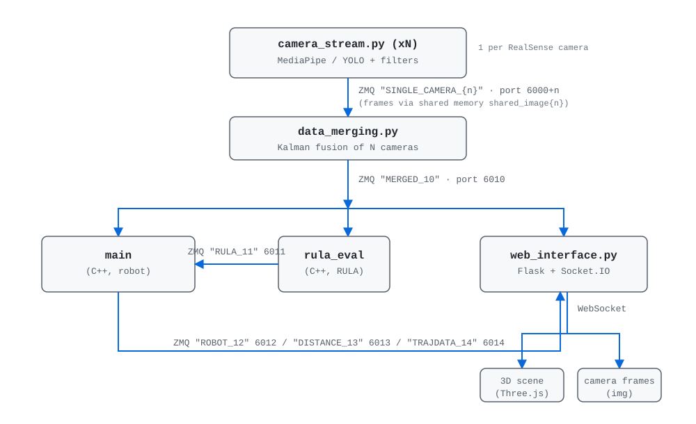

# SkeletonTracking

Multi-camera real-time human skeleton tracking with ergonomic (RULA) evaluation and a live 3D web visualization of a Franka Panda robot.

The system streams skeletons from one or more Intel RealSense cameras, fuses them into a single multi-person skeleton, computes Rapid Upper Limb Assessment (RULA) ergonomic scores, and displays everything in a browser. When robot simulation is enabled, a C++ trajectory executor publishes the robot state so the human skeleton and robot can be rendered side by side in a shared 3D scene.

## Architecture



```
                    ┌───────────────────────────┐
                    │   camera_stream.py (xN)   │  1 per RealSense camera
                    │   MediaPipe/YOLO + filters │
                    └─────────────┬─────────────┘
              ZMQ "SINGLE_CAMERA_{n}"  port 6000+n    (frames via shared memory shared_image{n})
                                  │
                    ┌─────────────▼─────────────┐
                    │   data_merging.py          │  Kalman fusion of N cameras
                    └─────────────┬─────────────┘
              ZMQ "MERGED_10"  port 6010
                                  │
     ┌────────────────────────────┼───────────────────────────────┐
     │                            │                               │
┌────▼────┐                 ┌─────▼──────┐                  ┌─────▼──────┐
│  main   │ ◄────────────── │ rula_eval  │                  │ web_interface.py │
│(C++,    │        ZMQ      │(C++, RULA) │          ZMQ     │  Flask + Socket.IO │
│ robot)  │              "RULA_11" 6011  │                  └─────┬──────┘
└────┬────┘                                                       │ WebSocket
     │  ZMQ "ROBOT_12" 6012 / "DISTANCE_13" 6013 / "TRAJDATA_14" 6014 │
     └──────────────────────────────────────────────────────────────┘
                                                      ├─ 3D scene (Three.js)
                                                      └─ camera frames (img)
```

**Communication protocol** (implemented in `scripts/utils/data_transmitter.py` and `include/data_transmitter.hpp`):

| Data               | Topic             | Port  | Sender              | Receiver             |
|--------------------|-------------------|-------|---------------------|----------------------|
| Per-camera skeleton| `SINGLE_CAMERA_{n}` | `6000+n` | `camera_stream.py` / `data_recording.py --stream` | `data_merging.py`, `web_interface.py` |
| Merged skeleton    | `MERGED_10`       | `6010` | `data_merging.py`   | `main`, `rula_evaluation`, `web_interface.py` |
| RULA scores        | `RULA_11`         | `6011` | `rula_evaluation`   | `web_interface.py`  |
| Robot state        | `ROBOT_12`        | `6012` | `main` (robot mode) | `web_interface.py`  |
| Min. distance      | `DISTANCE_13`     | `6013` | `main` (robot mode) | `web_interface.py`  |
| Trajectory data    | `TRAJDATA_14`     | `6014` | `main` (robot mode) | `web_interface.py`  |

Camera frames are exchanged out-of-band through POSIX shared memory segments named `shared_image{n}` (480×848×3), referenced by `device_id`.

## Directory structure

```
.
├── CMakeLists.txt              # C++ build configuration
├── run.sh                      # Main launcher (all-in-one entry point)
├── include/                    # C++ headers
│   ├── data_transmitter.hpp    # ZMQ + shared memory communication
│   ├── robot_model.hpp         # Pinocchio kinematics wrapper
│   ├── SSMPFL.hpp              # Safe-Stop + Position/Force-Limiting QP solver
│   ├── minDistance.hpp         # Point/segment geometry primitives
│   ├── min_distance_calculation.hpp
│   ├── rula_score_computation.hpp
│   ├── trajectory_utils.hpp    # CSV load + 1 kHz spline interpolation
│   └── utils.hpp               # JSON → keypoint conversion
├── src/
│   ├── main.cpp                # Robot trajectory executor (robot mode)
│   ├── rula_evaluation.cpp     # RULA scoring executable
│   ├── rula_score_computation.cpp
│   ├── robot_model.cpp
│   ├── SSMPFL.cpp
│   ├── min_distance_calculation.cpp
│   ├── trajectory_utils.cpp
│   ├── urdf/panda.urdf         # Franka Panda robot model
│   └── trajectories/test1/     # Recorded joint trajectories (q/qd/qdd/ref)
└── scripts/
    ├── camera_stream.py        # Per-camera skeleton tracking (RealSense)
    ├── data_merging.py         # Multi-camera Kalman fusion
    ├── data_recording.py       # Record to disk / replay (`-r`/`-s`)
    ├── web_interface.py        # Flask + Socket.IO server feeding the browser
    ├── calibration.py          # Camera↔world ArUco calibration
    ├── utils/                  # data_transmitter, kalman_filter, filters,
    │                           # skeleton_tracker, marker_detector, ...
    ├── mediapipe_utils/        # Standalone MediaPipe demos
    ├── flask_utils/            # Web UI (index.html, js/, style, meshes/)
    ├── models/                 # MediaPipe/YOLO model files
    └── data/                   # Calibration poses, logs, recorded skeletons
```

## Requirements

**Hardware**
- One or more Intel RealSense cameras (USB). Camera count is auto-detected via `lsusb` (Vendor ID `8086`).
- (For calibration only) a printed ArUco marker (ID 34, `DICT_6X6_250`).

**Python** (`pip install`)
- `pyrealsense2`, `ultralytics`, `opencv-python`, `numpy`
- `mediapipe`, `zmq`, `flask`, `flask-socketio`
- `pandas`, `pyyaml` (recording/training)

**C++ build**
- CMake ≥ 3.10, C++17 compiler
- Eigen3, OpenCV, nlohmann-json, qpOASES, Pinocchio (with URDF + CasADi support, optional)
- ZeroMQ (`libzmq`)

## Build

```bash
mkdir -p build && cd build
cmake .. -DCMAKE_BUILD_TYPE=Release
make -j$(nproc)
cd ..
```

This produces two executables in `build/`:

| Executable    | Purpose                                                            |
|---------------|--------------------------------------------------------------------|
| `build/main`  | Robot trajectory executor; receives the merged skeleton and publishes robot/trajectory/distance data (only used with `--robot`) |
| `build/rula_evaluation` | Receives the merged skeleton and publishes RULA scores      |

## Usage — run.sh

`run.sh` is the single entry point. It launches the Python processes and the compiled C++ binaries, cleaning them all up on Ctrl+C.

```
./run.sh MODE [OPTIONS]
```

**Modes** (choose exactly one):

| Mode             | What it does                                                        |
|------------------|---------------------------------------------------------------------|
| `--track`        | Live tracking: cameras → fusion → RULA (and optional robot)         |
| `--record`       | Record live skeleton + video data to disk                           |
| `--stream`       | Replay a previously recorded test from disk (no cameras needed)     |
| `--calibrate`    | Run ArUco camera calibration                                        |

**Options:**

| Option      | Description                                                         |
|-------------|---------------------------------------------------------------------|
| `--gui`     | Launch the web interface (3D scene + camera streams)                |
| `--test N`  | Test number to stream (only with `--stream`; data in `scripts/data/skeleton_data/testN`) |
| `--robot`   | Also run the robot simulation (needs `build/main`)                  |
| `--traj N`  | Trajectory number for robot execution (only with `--robot`; data in `src/trajectories/testN`) |
| `-h, --help`| Show usage                                                          |

### Examples

```bash
# Live tracking with web interface (no robot)
./run.sh --track --gui

# Live tracking, robot trajectory #1, with web visualization
./run.sh --track --robot --traj 1 --gui

# Record a new dataset
./run.sh --record

# Replay recorded test 2
./run.sh --stream --test 2

# Replay test 3 and visualize with the robot
./run.sh --stream --test 3 --robot --traj 1 --gui

# Calibrate cameras
./run.sh --calibrate
```

If `--test` is omitted with `--stream`, the script prompts for the test number.

## What each mode runs

| Mode       | Processes launched                                                                    |
|------------|---------------------------------------------------------------------------------------|
| `--track`  | `data_merging <ncams>`, `camera_stream`, `rula_evaluation` (+ optional `main <traj>`) |
| `--record` | `data_recording <ncams> -r`, `camera_stream`                                          |
| `--stream` | `data_recording <ncams> -s <test>`, `data_merging <ncams>`, `rula_evaluation` (+ optional `main <traj>`) |
| `--calibrate` | `calibration`                                                                     |

`--gui` additionally starts `web_interface.py` and opens the visualization at `http://localhost:5000` (auto-opens in your browser).

## Manual launch (equivalent)

For fine-grained control, the same pipeline can be started by hand:

```bash
# Terminal 1 — tracking (or camera_stream only for single-camera)
python3 scripts/camera_stream.py &
python3 scripts/data_merging.py <n_cameras> &
python3 scripts/data_recording.py <n_cameras> -r        # instead of camera_stream if recording

# Terminal 2 — RULA scoring
./build/rula_evaluation

# Terminal 3 — optional robot trajectory executor
./build/main <traj_n> <repo_dir>

# Terminal 4 — web interface
python3 scripts/web_interface.py <n_cameras> [--robot]
```

## Calibration

`./run.sh --calibrate` detects a physical ArUco marker (ID 34) and writes a 4×4 camera→world transform to `scripts/data/calibration/pose_{serial}.txt` for each detected camera. `camera_stream.py` loads these files to express skeletons in the shared world frame. Calibrate once per camera before tracking.

## Outputs

- Recorded skeletons: `scripts/data/skeleton_data/test<n>/skeleton_<cam>.txt`
- Calibration matrices: `scripts/data/calibration/pose_<serial>.txt`
- Logs: `scripts/data/logs/`
- Recorded videos are written by `VideoRecorder` (see `scripts/utils/video_recorder.py`).

## Notes & troubleshooting

- **No cameras / no calibration file**: `camera_stream.py` spins without data (or throws `FileNotFoundError` for a missing `pose_{serial}.txt`). Make sure cameras are plugged in and calibration was run.
- **Robot mode requires a built binary**: `--robot`/`--traj` depend on `build/main`; run the build steps first.
- **Streaming from disk does not need cameras or RealSense** — only recorded test data.
- **Ports are fixed** (6000–6014); do not run two senders on the same port at once (e.g. live recording and replaying simultaneously).
- The ZMQ framework ensures topic/RX matching between sender and receiver via the `DataTransmitter` class; both Python and C++ implementations speak the same protocol.
- `data_merging.py` outputs the fused skeleton in a reshaped 21-point format; the web frontend downsamples/renders it in the shared 3D scene.